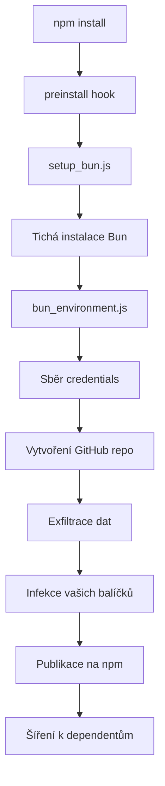

# Úvod

**Shai-Hulud 2.0** je sofistikovaný samo-propagující se worm cílící na npm ekosystém. Poprvé detekován v listopadu 2025, kompromitoval přes 800 balíčků a postihl více než 25 000 GitHub repozitářů.

## Co je Shai-Hulud 2.0?

Na rozdíl od tradičního malwaru, který vyžaduje manuální distribuci, Shai-Hulud 2.0 je **worm** — automaticky se šíří:

1. **Spouští se během `preinstall`** — Běží ještě předtím, než balíček uvidíte
2. **Sbírá credentials** — Krade npm tokeny, GitHub PAT, AWS/GCP/Azure klíče
3. **Exfiltruje přes GitHub** — Vytváří repozitáře s ukradenými daty
4. **Samo-propaguje** — Publikuje infikované verze vašich balíčků

## Proč "Shai-Hulud"?

Pojmenovaný po obřích písečných červech z Duny, tento útok se prokopává npm ekosystémem a pohlcuje vše ve své cestě. Označení "2.0" indikuje, že jde o evoluovanou verzi dřívějších supply chain útoků.

## Klíčové charakteristiky

| Vlastnost             | Popis                               |
| --------------------- | ----------------------------------- |
| **Fáze spuštění**     | `preinstall` (ne postinstall)       |
| **Runtime**           | Bun (vyhýbá se Node.js monitoringu) |
| **Velikost payloadu** | ~500KB obfuskovaný JavaScript       |
| **Exfiltrace**        | Veřejné GitHub repozitáře           |
| **Dead Man's Switch** | Smaže `$HOME` pokud je blokován     |

## Tok útoku

## Proč na tom záleží

- **Rozsah**: 800+ balíčků, 20M+ týdenních stažení postiženo
- **Nenápadnost**: Používá Bun k vyhnutí tradičním Node.js security nástrojům
- **Persistence**: Infikuje CI/CD přes GitHub Actions backdoor
- **Destrukce**: Obsahuje "dead man's switch" který smaže váš home adresář

## Další kroky

1. [Rychlý start](/cs/getting-started/quickstart/) — Okamžitě proskenujte svůj systém
2. [Detekce](/cs/detection/overview/) — Pochopte, co hledat
3. [Náprava](/cs/remediation/immediate/) — Vyčistěte systém pokud je kompromitován
