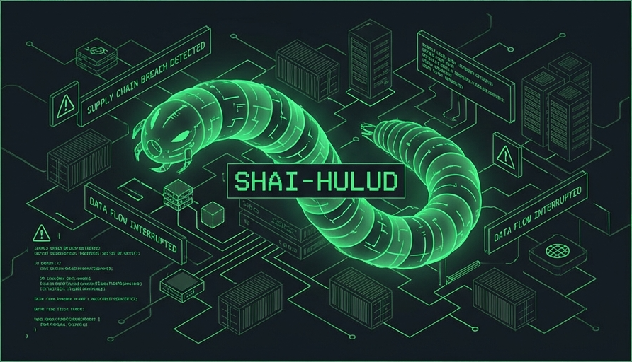

# 🪱 Don't Be Shy, Hulud



> **Praktický průvodce detekcí a ochranou proti npm supply-chain útokům**
> Zaměřeno na Shai-Hulud 2.0 (listopad 2025) a podobné hrozby

[](https://opensource.org/licenses/MIT)
[](http://makeapullrequest.com)


## ⚠️ KRITICKÉ: Varování Dead Man's Switch

> **🔴 Shai-Hulud 2.0 obsahuje destruktivní fallback mechanismus!**

Pokud malware nemůže exfiltrovat data nebo se propagovat (žádný GitHub/npm token, blokované síťové spojení), **PŘEPÍŠE A SMAŽE VŠECHNY ZAPISOVATELNÉ SOUBORY V HOME DIRECTORY**.

### ❌ NEDĚLEJTE:
- Násilné odpojení od internetu bez zálohy
- Okamžité blokování veškerého síťového provozu
- Kill podezřelých procesů bez správné izolace

### ✅ MÍSTO TOHO:
1. **Nejprve záloha** — Pokud možno, zkopírujte kritická data před jakýmkoli zásahem
2. **Selektivní síťová izolace** — Blokujte outbound kromě GitHub API
3. **Evidence collection** — Zachovejte logy před čištěním
4. **Postupujte opatrně** — Viz [docs/REMEDIATION.md](docs/REMEDIATION.md)

> Není to teoretické — wiper kód byl [potvrzen více bezpečnostními výzkumníky](https://securitylabs.datadoghq.com/articles/shai-hulud-2.0-npm-worm/).

---

## 🚨 URGENTNÍ: npm Token Deadline — 9. prosince 2025

npm ruší **VŠECHNY legacy (classic) tokeny** 9. prosince 2025 jako přímou reakci na Shai-Hulud útok.

### Zkontrolujte své tokeny teď:
```bash
npm token list
```

### Možnosti migrace:

#### Možnost 1: Trusted Publishing (Doporučeno)
```yaml
# .github/workflows/publish.yml
- uses: actions/setup-node@v4
  with:
    registry-url: 'https://registry.npmjs.org'
- run: npm publish --provenance --access public
  env:
    NODE_AUTH_TOKEN: ${{ secrets.NPM_TOKEN }}
```

#### Možnost 2: Granulární tokeny
- Max životnost: 90 dní (default 7 dní)
- Omezit na konkrétní packages
- Povolit IP allowlist pokud možno

📚 [npm Token Migration Guide](https://docs.npmjs.com/about-access-tokens)

---

## ⚡ TL;DR – Co dělat HNED

```bash
# 1. Stáhni tento repo
git clone https://github.com/miccy/dont-be-shy-hulud.git
cd dont-be-shy-hulud

# 2. Spusť rychlý audit (macOS/Linux)
chmod +x scripts/*.sh
./scripts/quick-audit.sh

# 3. Pokud jsi kompromitovaný, rotuj VŠECHNY credentials
./scripts/rotate-credentials.sh --help
```

## 📋 Obsah

- [Přehled hrozby](#-přehled-hrozby)
- [Detekce](#-detekce)
- [Remediation](#-remediation)
- [Prevence](#-prevence)
- [Common Issues](#-common-issues)
- [Case Study](#-case-study)
- [Scripty](#-scripty)
- [Konfigurace](#-konfigurace)
- [IOC databáze](#-ioc-databáze)

## 🎯 Přehled hrozby

### Shai-Hulud 2.0 (Listopad 2025)

| Vlastnost | Hodnota |
|-----------|---------|
| **Typ** | Self-propagating npm worm |
| **Kompromitované packages** | 796+ unique, 1092+ versions |
| **Zasažené GitHub repos** | 25,000+ |
| **Weekly downloads zasažených** | 20+ milionů |
| **Peak propagace** | 1,000 nových repos každých 30 minut |
| **Exfiltrované credentials** | 775+ GitHub, 373 AWS, 300 GCP, 115 Azure |

**Klíčové vlastnosti:**
- ⚡ Exekuce v **preinstall** fázi (ne postinstall)
- 🔄 Samoreplikace až 100 packages/infection
- 💀 Dead-man switch – destrukce dat při selhání exfiltrace
- 🚪 Persistent backdoor přes GitHub Discussions
- 🐳 Docker privilege escalation

**Payload soubory:**
- `setup_bun.js` – loader
- `bun_environment.js` – hlavní obfuskovaný payload

**Exfiltrované soubory:**
- `cloud.json`, `contents.json`, `environment.json`, `truffleSecrets.json`

➡️ [Podrobná analýza](docs/THREAT-OVERVIEW.md)

## 🔍 Detekce

### Rychlá kontrola

```bash
# Kontrola známých IOC souborů
find ~/Developer -name "setup_bun.js" -o -name "bun_environment.js" 2>/dev/null

# Kontrola podezřelých GitHub workflows
find ~/Developer -path "*/.github/workflows/*" -name "discussion.yaml" 2>/dev/null

# Kontrola .truffler-cache
ls -la ~/.truffler-cache 2>/dev/null

# Kontrola GitHub repos s Shai-Hulud description
gh repo list --json name,description | jq '.[] | select(.description | contains("Hulud"))'
```

### Automatizovaný audit

```bash
./scripts/full-audit.sh
```

➡️ [Kompletní detekční guide](docs/DETECTION.md)

## 🔧 Remediation

### Okamžité kroky

1. **Freeze npm/bun updates**
2. **Rotace credentials** (npm, GitHub, AWS, GCP, Azure)
3. **Smazání node_modules a cache**
4. **Reinstalace z čistých verzí**

```bash
# Kompletní čištění projektu
rm -rf node_modules
npm cache clean --force
# nebo
rm -rf node_modules bun.lockb
bun pm cache rm

# Reinstalace s disabled scripts
npm install --ignore-scripts
```

➡️ [Kompletní remediation guide](docs/REMEDIATION.md)

## 🛡️ Prevence

### Doporučené nástroje

| Nástroj | Účel | Cena |
|---------|------|------|
| [Socket.dev](https://socket.dev) | Supply-chain security | Free / Paid |
| [Snyk](https://snyk.io) | Vulnerability scanning | Free / Paid |
| [npm audit](https://docs.npmjs.com/cli/v10/commands/npm-audit) | Built-in audit | Free |
| [Renovate](https://renovatebot.com) | Dependency updates | Free |
| [Datadog SCFW](https://github.com/DataDog/supply-chain-firewall) | Firewall | Free (OSS) |

### Klíčová opatření

```bash
# Disable lifecycle scripts globálně
npm config set ignore-scripts true

# Nebo per-project v .npmrc
echo "ignore-scripts=true" >> .npmrc
```

### ⚠️ Kritické pro Bun uživatele

**Bun má známý bug**: Nastavení `.npmrc` `ignore-scripts=true` **NEFUNGUJE** spolehlivě!

Bun upřednostňuje interní `trustedDependencies` allowlist před `.npmrc` nastaveními.

```bash
# ❌ Toto NENÍ spolehlivé v Bun:
echo "ignore-scripts=true" >> .npmrc

# ✅ VŽDY použijte CLI flag:
bun install --ignore-scripts
```

➡️ [Kompletní prevention guide](docs/PREVENTION.md)

## 🔧 Common Issues

Časté nálezy ze security scanů:

| Issue | Příčina | Řešení |
|-------|---------|--------|
| Transitivní CVE | Stará závislost v dependency tree | `npm ls package` → update parent |
| Špatný package name | `biome` místo `@biomejs/biome` | Přeinstaluj správný package |
| `unstableOwnership` | Změna maintainera | Často false positive (Google, Biome) |
| `obfuscatedFile` | Minifikovaný kód | Ověř na npm/GitHub |

➡️ [Kompletní common issues guide](docs/COMMON-ISSUES.md)

## 📈 Case Study

Praktický příklad analýzy 78 alertů ze Socket.dev:

- 2 Critical → opraveno (špatný `biome` package)
- 39 High → 30 false positives (workbox, biomejs)
- Čas na analýzu: 30 minut
- Čas na opravu: 10 minut

➡️ [Kompletní case study](docs/CASE-STUDY-SOCKET-ANALYSIS.md)

## 📜 Scripty

| Script | Účel |
|--------|------|
| [`quick-audit.sh`](../scripts/quick-audit.sh) | Rychlý security audit (5 min) |
| [`full-audit.sh`](../scripts/full-audit.sh) | Kompletní audit s IOC skenováním |
| [`scan-node-modules.sh`](../scripts/scan-node-modules.sh) | Skenování node_modules ve všech projektech |
| [`check-github-repos.sh`](../scripts/check-github-repos.sh) | Kontrola GitHub repos na kompromitaci |
| [`rotate-credentials.sh`](../scripts/rotate-credentials.sh) | Asistovaná rotace credentials |
| [`harden-npm.sh`](../scripts/harden-npm.sh) | Hardening npm/bun konfigurace |

## ⚙️ Konfigurace

| Soubor | Účel |
|--------|------|
| [`renovate-lockdown.json`](../configs/renovate-lockdown.json) | Renovate config pro krizový lockdown |
| [`renovate-hardened.json`](../configs/renovate-hardened.json) | Renovate config pro běžný provoz |
| [`socket.yml`](../configs/socket.yml) | Socket.dev konfigurace |
| [`.npmrc-secure`](../configs/.npmrc-secure) | Bezpečná .npmrc template |

## 📊 IOC databáze

Aktualizované seznamy IOC (Indicators of Compromise):

- [`malicious-packages.json`](../ioc/malicious-packages.json) – Seznam kompromitovaných packages
- [`malicious-hashes.json`](../ioc/malicious-hashes.json) – SHA hashes malicious payloads
- [`github-repos.json`](../ioc/github-repos.json) – Známé exfiltration repos

**Zdroje IOC:**
- [Tenable IOC List](https://github.com/tenable/shai-hulud-second-coming-affected-packages)
- [Datadog IOC List](https://github.com/DataDog/indicators-of-compromise/tree/main/shai-hulud-2.0)
- [SafeDep Response](https://github.com/safedep/shai-hulud-migration-response)
- [Wiz IOC CSV](https://github.com/wiz-sec-public/wiz-research-iocs)

## 🤝 Contributing

PRs jsou vítány! Zejména:
- Nové detekční scripty
- Aktualizace IOC
- Dokumentace pro specifické platformy
- Překlady
- CI/CD integrace

## 🛠️ Správa repozitáře

### Výběr jazyka

Tento repozitář obsahuje dvojjazyčnou dokumentaci (EN/CS). Pokud chcete ponechat jen jeden jazyk:

```bash
# Ponechat jen Češtinu (přesune soubory z cs/ do rootu a smaže anglické)
./scripts/set-language.sh cs

# Ponechat jen Angličtinu (smaže složku cs/)
./scripts/set-language.sh en
```

Toto můžete provést i přes **GitHub Actions**: Jděte na `Actions` -> `Set Repository Language` -> `Run workflow`.

### VS Code Integrace

Projekt obsahuje předpřipravené VS Code tasks. Stiskněte `Cmd+Shift+P` -> `Tasks: Run Task` pro spuštění:
- `🛡️ Quick Audit`
- `🔍 Full Audit`
- `🧹 Set Language`

## 📚 Reference

- [HackerOne Blog](https://www.hackerone.com/blog/shai-hulud-2-npm-worm-supply-chain-attack)
- [Socket.dev Analysis](https://socket.dev/blog/shai-hulud-strikes-again-v2)
- [Palo Alto Unit 42](https://unit42.paloaltonetworks.com/npm-supply-chain-attack/)
- [Datadog Security Labs](https://securitylabs.datadoghq.com/articles/shai-hulud-2.0-npm-worm/)
- [Wiz Research](https://www.wiz.io/blog/shai-hulud-2-0-ongoing-supply-chain-attack)
- [CISA Alert](https://www.cisa.gov/news-events/alerts/2025/09/23/widespread-supply-chain-compromise-impacting-npm-ecosystem)

## 📄 License

MIT – viz [LICENSE](../LICENSE)

---

> 💡 **Tip:** Přidej ⭐ pokud ti tento guide pomohl!

> ⚠️ **Disclaimer:** Tento guide je poskytován "as is". Autoři nenesou odpovědnost za škody způsobené použitím nebo nepoužitím těchto informací.

---

<div align="center">
  <p>🛠 Od <a href="https://github.com/miccy">@miccy</a> z nenávisti k Červům 🤬</p>
</div>
