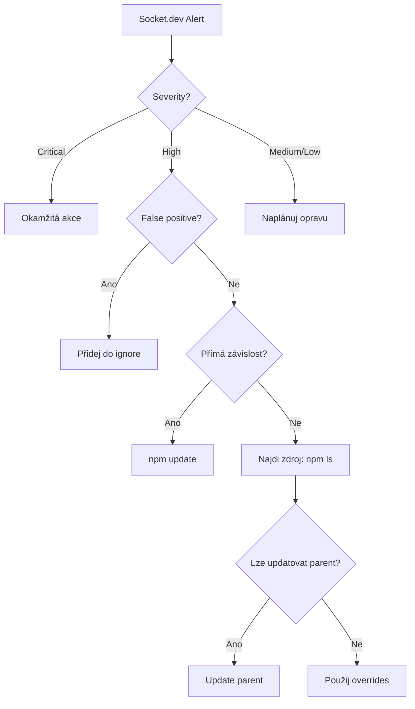

# 📊 Case Study: Socket.dev Alert Analysis

> Praktický příklad analýzy security alertů z reálného portfolia projektů

## Kontext

- **Datum:** Listopad 2025
- **Nástroj:** Socket.dev (Team plan)
- **Počet skenovaných repos:** 7
- **Celkem alertů:** 78

## Přehled alertů

### Podle severity

| Severity | Počet | Akce |
|----------|-------|------|
| 🔴 Critical | 2 | Okamžitá oprava |
| 🟠 High | 39 | Řešit do 24h |
| 🟡 Medium | 29 | Řešit do týdne |
| 🟢 Low | 8 | Monitoring |

### Podle typu

| Typ | Počet | Popis |
|-----|-------|-------|
| `criticalCVE` | 2 | Kritické zranitelnosti |
| `cve` / `highCVE` | 8 | Vysoké zranitelnosti |
| `mediumCVE` | 15 | Střední zranitelnosti |
| `unstableOwnership` | 25 | Změna maintainera |
| `obfuscatedFile` | 5 | Obfuskovaný kód |
| `gitHubDependency` | 2 | Přímá GitHub závislost |
| `installScripts` | 5 | Lifecycle scripts |

## Detailní analýza

### 🔴 Critical: lodash@3.10.1

**Repo:** legenda-bar  
**Typ:** Transitivní závislost (Development)

**Příčina:**
```
legenda-bar
└── biome@0.3.3 (WRONG PACKAGE!)
    └── lodash@3.10.1
```

Uživatel omylem nainstaloval `biome` místo `@biomejs/biome`.

**CVEs:**
- Prototype Pollution (CVE-2019-10744)
- Prototype Pollution (CVE-2020-8203)
- Command Injection (CVE-2021-23337)
- ReDoS (CVE-2020-28500)

**Řešení:**
```bash
npm uninstall biome
npm install -D @biomejs/biome
rm -rf node_modules && npm install

# Socket automatická oprava a optimalizace
socket fix ./
socket optimize ./
```

**Výsledek po opravě:**
```json
{
  "devDependencies": {
    "@biomejs/biome": "^2.3.8"
  },
  "resolutions": {
    "yocto-spinner": "npm:@socketregistry/yocto-spinner@^1"
  }
}
```

Socket CLI automaticky přidal hardened verzi z Socket Registry.

**Poučení:** Vždy ověř správný název package před instalací.

---

### 🔴 Critical: form-data@2.3.3

**Repo:** legenda-bar  
**Typ:** Transitivní závislost (Development)

**Příčina:** Stejná jako výše - přichází z `biome@0.3.3`.

**Řešení:** Stejné jako výše.

---

### 🟠 High: astro@5.15.4

**Repos:** li-tr-cz, 7transfer  
**Typ:** Přímá závislost (Production)

**Alert:** CVE + mediumCVE

**Řešení:**
```bash
npm update astro
# Nebo specifická verze:
npm install astro@latest
```

**Status:** Zkontrolovat changelogy pro breaking changes.

---

### 🟠 High: workbox-*@7.4.0 (15 packages)

**Repo:** pawnshop-os  
**Typ:** Transitivní závislost (Production)

**Alert:** `unstableOwnership`

**Analýza:**
- Workbox je od Google
- Ownership změny jsou běžné (interní procesy)
- Package je legitimní a široce používaný

**Verdikt:** ✅ FALSE POSITIVE

**Akce:** 
- Přidat do Socket.dev ignore listu
- Nebo pinovat konkrétní verzi

---

### 🟠 High: @biomejs/cli-*@2.3.4 (6 packages)

**Repos:** li-tr-cz, 7transfer  
**Typ:** Transitivní závislost (Development)

**Alert:** `unstableOwnership`

**Analýza:**
- Biome je aktivně vyvíjený projekt
- Nedávno přešel z Rome na Biome
- Legitimní, široce používaný

**Verdikt:** ✅ FALSE POSITIVE

---

### 🟠 High: safer-buffer@2.1.2

**Repos:** multiple  
**Typ:** Transitivní závislost (Development)

**Alert:** `obfuscatedFile`

**Analýza:**
- Package obsahuje minifikované testy
- Legitimní package, široce používaný
- Poslední update 2018, ale stabilní

**Verdikt:** ✅ FALSE POSITIVE (ale zvážit alternativu)

---

### 🟠 High: volar-service-emmet@0.0.66

**Repos:** 21-000-000.github.io, 7transfer  
**Typ:** Transitivní závislost

**Alert:** `gitHubDependency`

**Analýza:**
- Package závisí přímo na GitHub repo
- Riziko: repo může být smazáno/změněno

**Akce:**
1. Zkontrolovat zda existuje npm verze
2. Pokud ne, pinovat na konkrétní commit

---

### 🟡 Medium: electron@35.7.5

**Repo:** ignis  
**Typ:** Přímá závislost (Development)

**Alert:** `installScripts`

**Analýza:**
- Electron vyžaduje postinstall script pro stažení binárky
- Legitimní, očekávané chování

**Verdikt:** ✅ EXPECTED BEHAVIOR

---

### 🟡 Medium: jszip@2.5.0

**Repo:** ignis  
**Typ:** Transitivní závislost (Production)

**Alert:** `mediumCVE`

**Akce:**
```bash
# Zkontroluj odkud přichází
npm ls jszip

# Pokud možno, updatuj
npm update jszip
```

---

## Souhrn akcí

### Okamžité (Critical)

```bash
# legenda-bar
cd legenda-bar
npm uninstall biome
npm install -D @biomejs/biome
rm -rf node_modules && npm install
npm audit
```

### Tento týden (High - skutečné issues)

```bash
# Astro projekty
cd li-tr-cz && npm update astro
cd 7transfer && npm update astro

# Zkontroluj glob
npm ls glob
npm update glob
```

### Konfigurace Socket.dev (False positives)

Přidej do `.socket.yml`:

```yaml
ignore:
  - package: "workbox-*"
    issue: "unstableOwnership"
    reason: "Google package - frequent ownership changes are expected"
    expires: "2026-01-01"
  
  - package: "@biomejs/*"
    issue: "unstableOwnership"
    reason: "Active development project"
    expires: "2026-01-01"
  
  - package: "safer-buffer"
    issue: "obfuscatedFile"
    reason: "Minified tests, not actual obfuscation"
    expires: "2026-01-01"
```

## Metriky po opravě

| Metrika | Před | Po |
|---------|------|-----|
| Critical alerts | 2 | 0 |
| High alerts | 39 | ~5 (skutečné) |
| False positives | ~30 | 0 (ignorováno) |
| Celkové riziko | Vysoké | Nízké |

## Poučení

1. **Ověřuj názvy packages** - `biome` ≠ `@biomejs/biome`
2. **False positives jsou běžné** - nepanikaři, analyzuj
3. **Transitivní závislosti** - většina issues přichází z nich
4. **Pravidelný audit** - nastav CI/CD automatizaci
5. **Dokumentuj rozhodnutí** - proč jsi něco ignoroval

## Doporučený workflow


