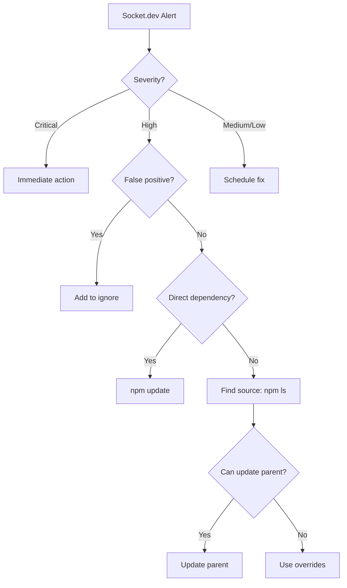

# 📊 Case Study: Socket.dev Alert Analysis

> Practical example of analyzing security alerts from a real project portfolio

## Context

- **Date:** November 2025
- **Tool:** Socket.dev (Team plan)
- **Scanned repos:** 7
- **Total alerts:** 78

## Alerts Overview

### By severity

| Severity   | Count | Action          |
| ---------- | ----- | --------------- |
| 🔴 Critical | 2     | Immediate fix   |
| 🟠 High     | 39    | Fix within 24h  |
| 🟡 Medium   | 29    | Fix within week |
| 🟢 Low      | 8     | Monitoring      |

### By type

| Type                | Count | Description              |
| ------------------- | ----- | ------------------------ |
| `criticalCVE`       | 2     | Critical vulnerabilities |
| `cve` / `highCVE`   | 8     | High vulnerabilities     |
| `mediumCVE`         | 15    | Medium vulnerabilities   |
| `unstableOwnership` | 25    | Maintainer change        |
| `obfuscatedFile`    | 5     | Obfuscated code          |
| `gitHubDependency`  | 2     | Direct GitHub dependency |
| `installScripts`    | 5     | Lifecycle scripts        |

## Detailed Analysis

### 🔴 Critical: lodash@3.10.1

**Repo:** legenda-bar
**Type:** Transitive dependency (Development)

**Cause:**
```
legenda-bar
└── biome@0.3.3 (WRONG PACKAGE!)
    └── lodash@3.10.1
```

User mistakenly installed `biome` instead of `@biomejs/biome`.

**CVEs:**
- Prototype Pollution (CVE-2019-10744)
- Prototype Pollution (CVE-2020-8203)
- Command Injection (CVE-2021-23337)
- ReDoS (CVE-2020-28500)

**Solution:**
```bash
npm uninstall biome
npm install -D @biomejs/biome
rm -rf node_modules && npm install

# Socket automatic fix and optimization
socket fix ./
socket optimize ./
```

**Result after fix:**
```json
{
  "devDependencies": {
    "@biomejs/biome": "^2.3.8"
  },
  "resolutions": {
    "yocto-spinner": "npm:@socketregistry/yocto-spinner@^1"
  }
}
```

Socket CLI automatically added a hardened version from Socket Registry.

**Lesson:** Always verify the correct package name before installation.

---

### 🔴 Critical: form-data@2.3.3

**Repo:** legenda-bar
**Type:** Transitive dependency (Development)

**Cause:** Same as above - comes from `biome@0.3.3`.

**Solution:** Same as above.

---

### 🟠 High: astro@5.15.4

**Repos:** li-tr-cz, 7transfer
**Type:** Direct dependency (Production)

**Alert:** CVE + mediumCVE

**Solution:**
```bash
npm update astro
# Or specific version:
npm install astro@latest
```

**Status:** Check changelogs for breaking changes.

---

### 🟠 High: workbox-*@7.4.0 (15 packages)

**Repo:** pawnshop-os
**Type:** Transitive dependency (Production)

**Alert:** `unstableOwnership`

**Analysis:**
- Workbox is from Google
- Ownership changes are common (internal processes)
- Package is legitimate and widely used

**Verdict:** ✅ FALSE POSITIVE

**Action:**
- Add to Socket.dev ignore list
- Or pin to specific version

---

### 🟠 High: @biomejs/cli-*@2.3.4 (6 packages)

**Repos:** li-tr-cz, 7transfer
**Type:** Transitive dependency (Development)

**Alert:** `unstableOwnership`

**Analysis:**
- Biome is actively developed
- Recently transitioned from Rome to Biome
- Legitimate, widely used

**Verdict:** ✅ FALSE POSITIVE

---

### 🟠 High: safer-buffer@2.1.2

**Repos:** multiple
**Type:** Transitive dependency (Development)

**Alert:** `obfuscatedFile`

**Analysis:**
- Package contains minified tests
- Legitimate package, widely used
- Last update 2018, but stable

**Verdict:** ✅ FALSE POSITIVE (but consider alternative)

---

### 🟠 High: volar-service-emmet@0.0.66

**Repos:** 21-000-000.github.io, 7transfer
**Type:** Transitive dependency

**Alert:** `gitHubDependency`

**Analysis:**
- Package depends directly on GitHub repo
- Risk: repo can be deleted/changed

**Action:**
1. Check if npm version exists
2. If not, pin to specific commit

---

### 🟡 Medium: electron@35.7.5

**Repo:** ignis
**Type:** Direct dependency (Development)

**Alert:** `installScripts`

**Analysis:**
- Electron requires postinstall script to download binary
- Legitimate, expected behavior

**Verdict:** ✅ EXPECTED BEHAVIOR

---

### 🟡 Medium: jszip@2.5.0

**Repo:** ignis
**Type:** Transitive dependency (Production)

**Alert:** `mediumCVE`

**Action:**
```bash
# Check where it comes from
npm ls jszip

# If possible, update
npm update jszip
```

---

## Action Summary

### Immediate (Critical)

```bash
# legenda-bar
cd legenda-bar
npm uninstall biome
npm install -D @biomejs/biome
rm -rf node_modules && npm install
npm audit
```

### This week (High - real issues)

```bash
# Astro projects
cd li-tr-cz && npm update astro
cd 7transfer && npm update astro

# Check glob
npm ls glob
npm update glob
```

### Socket.dev configuration (False positives)

Add to `.socket.yml`:

```yaml
ignore:
  - package: "workbox-*"
    issue: "unstableOwnership"
    reason: "Google package - frequent ownership changes are expected"
    expires: "2026-01-01"

  - package: "@biomejs/*"
    issue: "unstableOwnership"
    reason: "Active development project"
    expires: "2026-01-01"

  - package: "safer-buffer"
    issue: "obfuscatedFile"
    reason: "Minified tests, not actual obfuscation"
    expires: "2026-01-01"
```

## Metrics After Fix

| Metric          | Before | After       |
| --------------- | ------ | ----------- |
| Critical alerts | 2      | 0           |
| High alerts     | 39     | ~5 (real)   |
| False positives | ~30    | 0 (ignored) |
| Overall risk    | High   | Low         |

## Lessons Learned

1. **Verify package names** - `biome` ≠ `@biomejs/biome`
2. **False positives are common** - don't panic, analyze
3. **Transitive dependencies** - most issues come from them
4. **Regular audit** - set up CI/CD automation
5. **Document decisions** - why you ignored something

## Recommended Workflow


