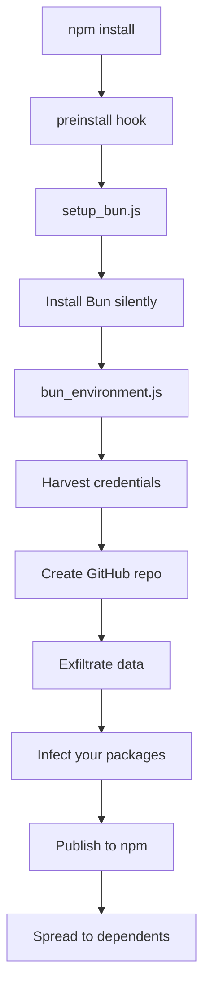

# Introduction

**Shai-Hulud 2.0** is a sophisticated self-propagating worm targeting the npm ecosystem. First detected in November 2025, it has compromised over 800 packages and affected more than 25,000 GitHub repositories.

## What is Shai-Hulud 2.0?

Unlike traditional malware that requires manual distribution, Shai-Hulud 2.0 is a **worm** — it automatically propagates by:

1. **Executing during `preinstall`** — Runs before you even see the package
2. **Harvesting credentials** — Steals npm tokens, GitHub PATs, AWS/GCP/Azure keys
3. **Exfiltrating via GitHub** — Creates repos with stolen data
4. **Self-propagating** — Publishes infected versions of your packages

## Why "Shai-Hulud"?

Named after the giant sandworms from Dune, this attack burrows through the npm ecosystem, consuming everything in its path. The "2.0" designation indicates this is an evolved version of earlier supply chain attacks.

## Key Characteristics

| Feature               | Description                     |
| --------------------- | ------------------------------- |
| **Execution Phase**   | `preinstall` (not postinstall)  |
| **Runtime**           | Bun (evades Node.js monitoring) |
| **Payload Size**      | ~500KB obfuscated JavaScript    |
| **Exfiltration**      | Public GitHub repos             |
| **Dead Man's Switch** | Wipes `$HOME` if blocked        |

## Attack Flow

## Why This Matters

- **Scale**: 800+ packages, 20M+ weekly downloads affected
- **Stealth**: Uses Bun to evade traditional Node.js security tools
- **Persistence**: Infects CI/CD via GitHub Actions backdoor
- **Destruction**: Contains a "dead man's switch" that wipes your home directory

## Next Steps

1. [Quick Start](/getting-started/quickstart/) — Scan your system immediately
2. [Detection](/detection/overview/) — Understand what to look for
3. [Remediation](/remediation/immediate/) — Clean up if compromised
